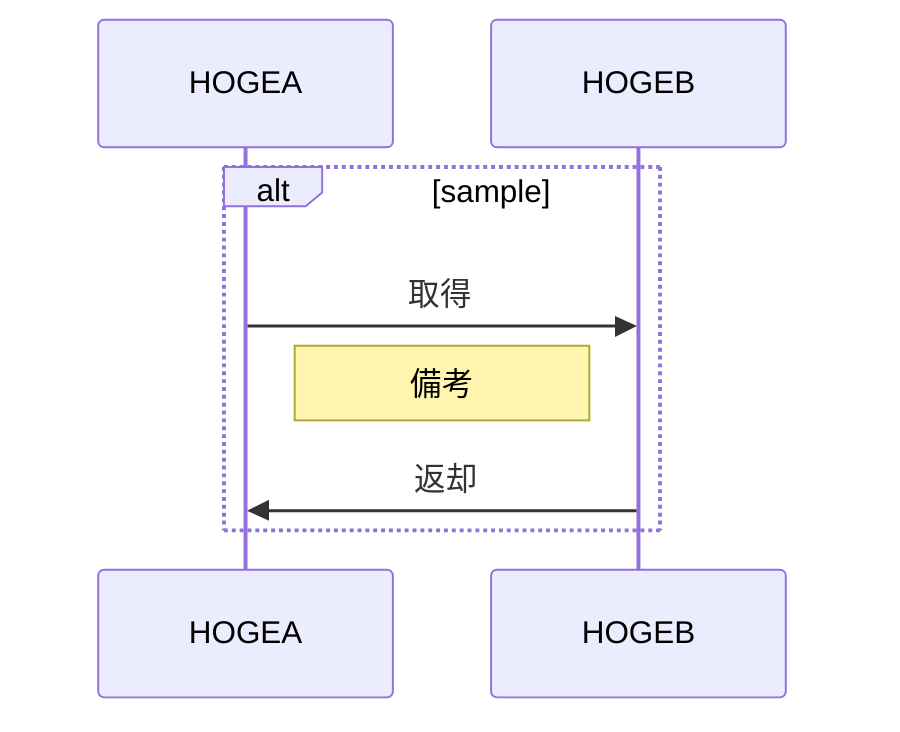

## 概要

## 詳細

### 画面イメージ

※ Figmalink貼る。

### 機能1

#### 概要

#### 項目詳細

※ 不必要な部分は削って記載してください。

| 項目名 | 振る舞い | 取得元コレクション | 取得元フィールド名 | 遷移先URL | 備考 |
| ------ | -------- | ------------------ | ------------------ | --------- | ---- |
| - | - | - | - | - | - |

### 機能2

#### 概要

#### 項目詳細

※ 不必要な部分は削って記載してください。

| 項目名 | 振る舞い | 取得元コレクション | 取得元フィールド名 | 遷移先URL | 備考 |
| ------ | -------- | ------------------ | ------------------ | --------- | ---- |
| - | - | - | - | - | - |

### シーケンス

#### シーケンス名

※ 発火タイミング
- hoge
- hoge

## 備考
